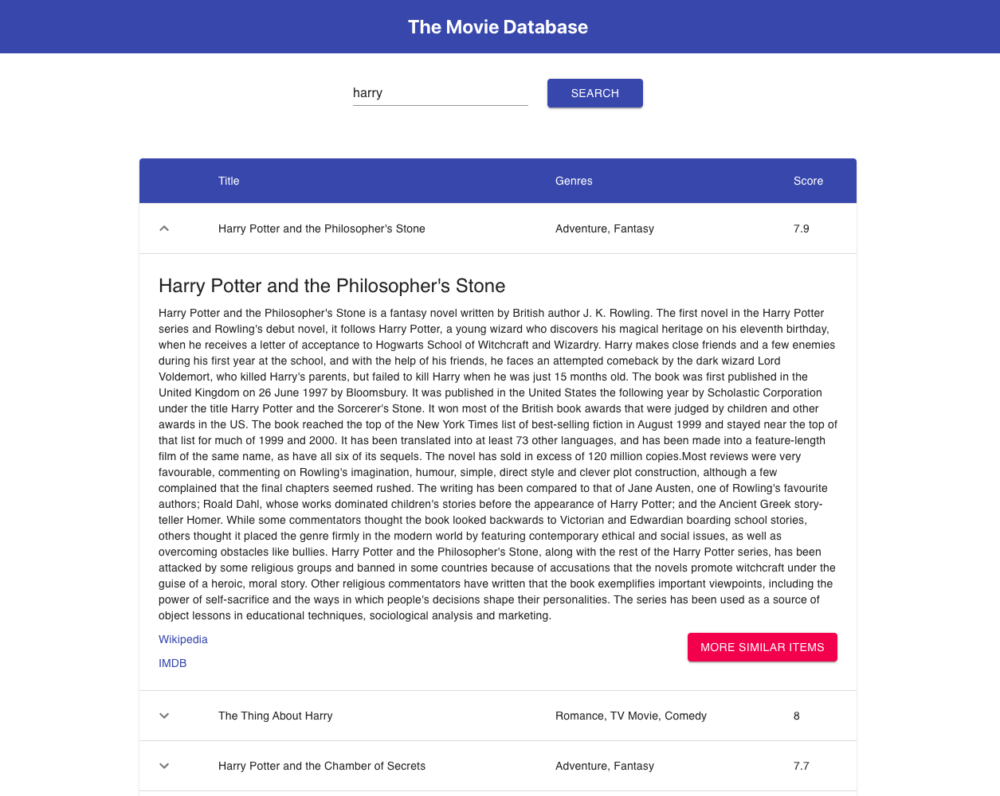

# The Movie Database

## Required environment variables

```
REACT_APP_API_URL=https://tmdb.sandbox.zoosh.ie/dev/graphql
REACT_APP_WIKI_URL=https://en.wikipedia.org
REACT_APP_IMDB_URL=https://www.imdb.com
```

``or just copy .env.dist into a .env file``

## How to run the application

- clone the repository
- `yarn` (installing dependencies)
- `yarn start` (starting development server)
- `yarn test` (runing tests)

## UI


